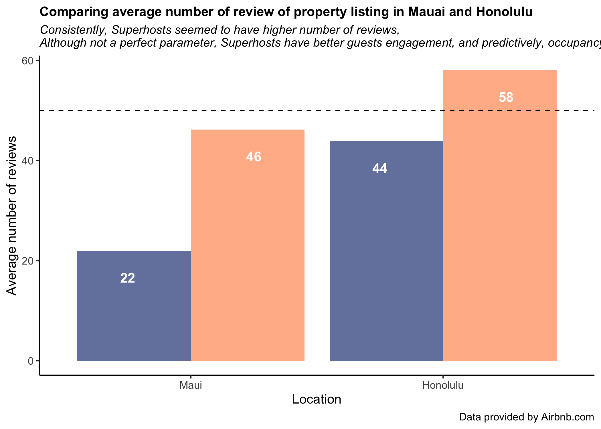

```{r echo = FALSE}
# Course: 5210 Communicating Data
# Purpose: Final Presentation
# Date: December 12, 2019
# Author: Yovinda Pricila

```


Superhost Requirement
===============================================

<div style="float: left; width: 95%;">

{width=30%}
{width=30%}

{width=100%}
</div>
Superhost Requirement
===============================================

<div style="float: left; width: 95%;">

{width=60%}

+ Low review rate in Airbnb hawaii. 
+ What causes a slow down of new host growth in Hawaii?

</div>
Comparing price median and review 
===============================================

{width=45%}
{width=45%}

+ Average nightly rate of regular host is roughly $9.8 to $24.2 higher than Superhost!
+ However, nightly rate signficantly differ in four locations: Kauai, Maui, Honolulu, and Hawaii* 
+ In general, Superhost earned lower nightly rate but higher number of reviews. 

</div>
Implementation of the Program.. is it working?
===============================================
{width=60%}

+ only 66.7% of Superhost actually fulfilled the requirement.
+ while there's 24& of regular host that should be rewarded with the status. 

</div>


Recommendations
===============================================

<div style="float: left; width: 95%;">

+ Stricter governance of Superhost reward
  + Statistically, host with >96% score and >90% response rate sells $19 to $31 higher nightly rate 
  + Further advertisement on SH listing would improve occupancy, and therefore, profit. 
  + Improve fairness and higher benchmark 
  
+ Important caveats: 
  + Further data required on the occupied nights per available night 
  + Further data required on hosts' cancellation rate. 


+ Reach my e-mail at pricilay@seattleu.edu

</div>